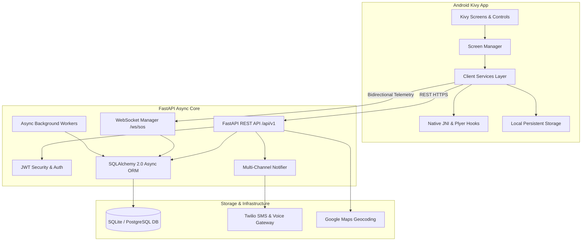

# AlertX2 System Architecture

## System Components

1. **Android Client (`android/`)**:
   - Built on Kivy and KivyMD for cross-platform modern mobile interfaces.
   - Utilizes `plyer` and Android Native JNI wrappers to access hardware sensors, GPS telemetry, SMS dispatch, and audio recording.
   - Offline-resilient with local persistent caching.

2. **Backend Engine (`backend/`)**:
   - Asynchronous FastAPI ASGI framework.
   - Real-time bi-directional WebSocket broadcasting for continuous live location streams.
   - High-throughput database layer via SQLAlchemy async engine supporting PostgreSQL and SQLite.

3. **External Services**:
   - Twilio Telephony for immediate emergency SMS alerts and automated emergency voice calls.
   - Google Maps for reverse geocoding and live navigation URLs.
