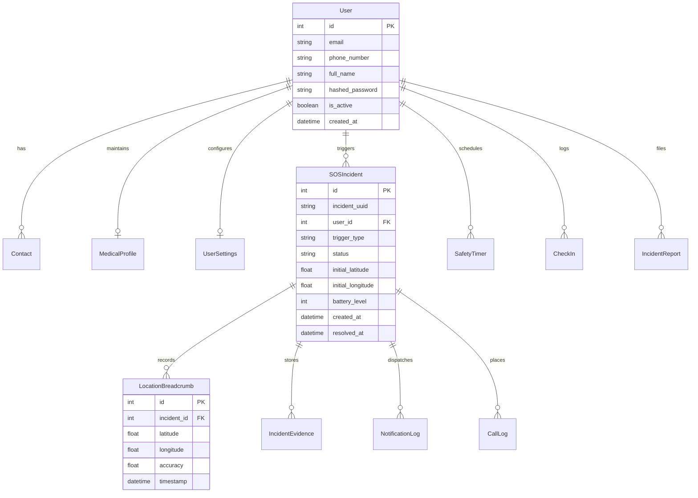

# AlertX2 Database Schema & ERD

```mermaid
erDiagram
    User ||--o{ Contact : "has"
    User ||--o| MedicalProfile : "maintains"
    User ||--o| UserSettings : "configures"
    User ||--o{ SOSIncident : "triggers"
    User ||--o{ SafetyTimer : "schedules"
    User ||--o{ CheckIn : "logs"
    User ||--o{ IncidentReport : "files"
    
    SOSIncident ||--o{ LocationBreadcrumb : "records"
    SOSIncident ||--o{ IncidentEvidence : "stores"
    SOSIncident ||--o{ NotificationLog : "dispatches"
    SOSIncident ||--o{ CallLog : "places"

    User {
        int id PK
        string email
        string phone_number
        string full_name
        string hashed_password
        boolean is_active
        datetime created_at
    }

    SOSIncident {
        int id PK
        string incident_uuid
        int user_id FK
        string trigger_type
        string status
        float initial_latitude
        float initial_longitude
        int battery_level
        datetime created_at
        datetime resolved_at
    }

    LocationBreadcrumb {
        int id PK
        int incident_id FK
        float latitude
        float longitude
        float accuracy
        datetime timestamp
    }
```
