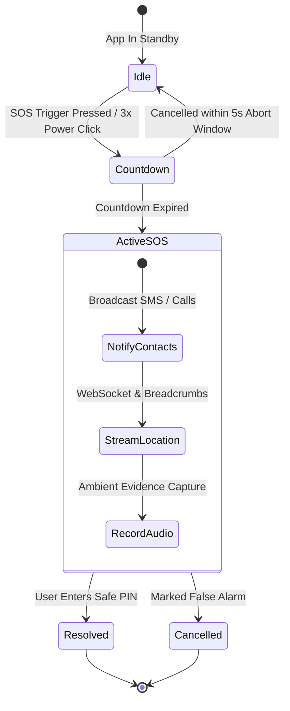

# SOS Dispatch & Lifecycle State Machine

```mermaid
stateDiagram-v2
    [*] --> Idle: App In Standby
    Idle --> Countdown: SOS Trigger Pressed / 3x Power Click
    Countdown --> Idle: Cancelled within 5s Abort Window
    Countdown --> ActiveSOS: Countdown Expired
    
    state ActiveSOS {
        [*] --> NotifyContacts: Broadcast SMS / Calls
        NotifyContacts --> StreamLocation: WebSocket & Breadcrumbs
        StreamLocation --> RecordAudio: Ambient Evidence Capture
    }

    ActiveSOS --> Resolved: User Enters Safe PIN
    ActiveSOS --> Cancelled: Marked False Alarm
    Resolved --> [*]
    Cancelled --> [*]
```
